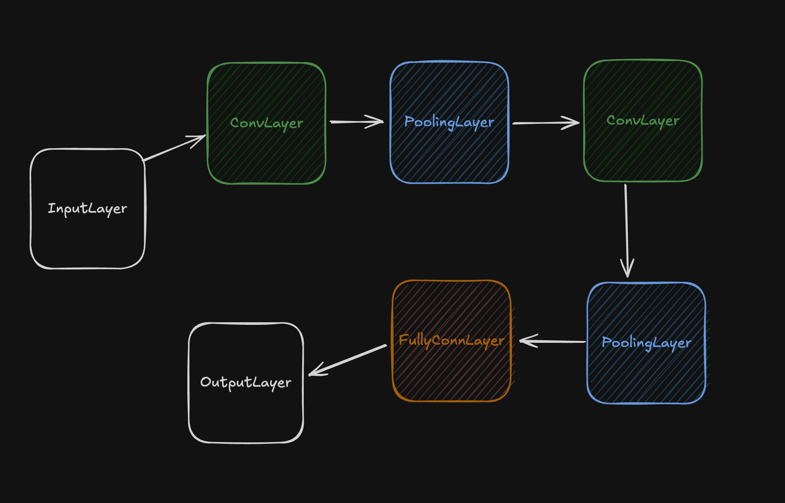

# Voice Authentication System

## Overview

This project implements a voice authentication system using deep learning techniques. It processes audio input to determine whether the speaker is the authorized user (owner) or not.

## Implementation Details

### Audio Preprocessing

- Sample data is gathered from the PyQt recorder ui and saved to the `recordings/` directory.
- Audio files are loaded and converted to MFCCs using torchaudio
- MFCC features are extracted with 40 coefficients

### Model Architecture

The CNN model (`VoiceAuthCNN`) consists of:
- 3 Convolutional layers with ReLU activation and max pooling
- Adaptive average pooling to handle variable input sizes
- 3 Fully connected layers
- 

### Training Process

- Uses Binary Cross-Entropy Loss with logits
- Adam optimizer
- Handles variable-length inputs through padding in batches

### Prediction

- Preprocesses input audio similarly to training data
- Outputs a probability of the audio belonging to the authorized user
